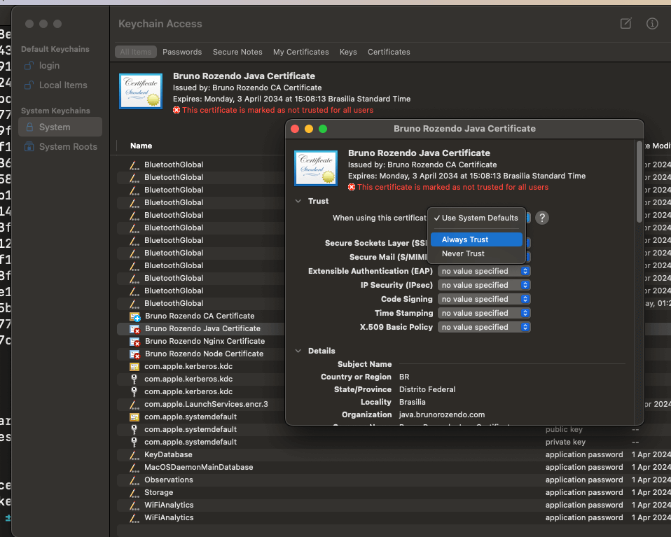
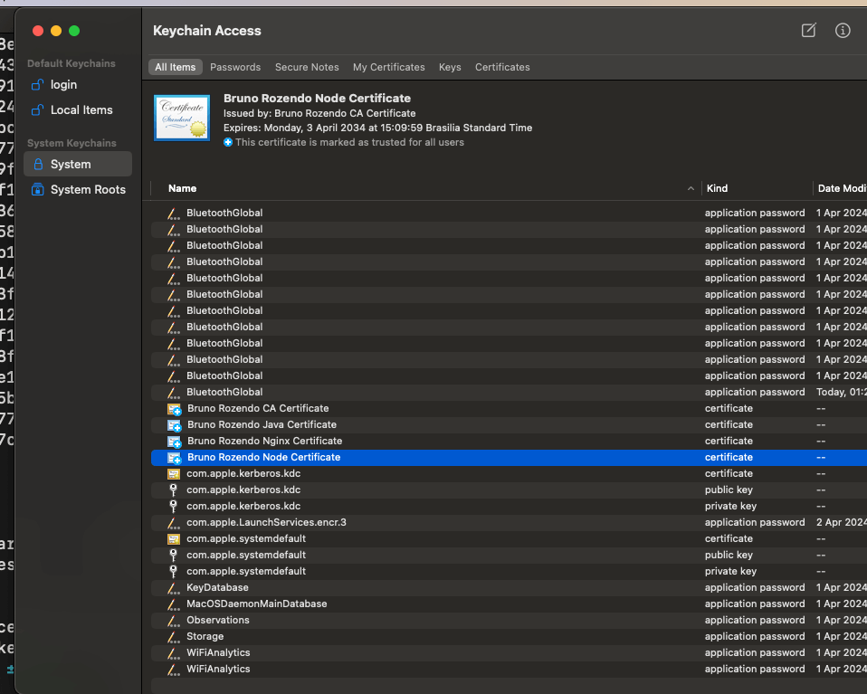

# self signed certificate

Self-signed certificate for local development or intranet

I tried to keep the extensions as faithful as possible, instead of using *.pem indiscriminately.


 - *.pkcs8 = key 
 - *.cnf &nbsp;&nbsp;&nbsp;&nbsp;&nbsp;= some file with  key/value properties
 - *.csr   &nbsp;&nbsp;&nbsp;&nbsp;&nbsp;= certificate signing request
 - *.crt   &nbsp;&nbsp;&nbsp;&nbsp;&nbsp;&nbsp;= certificate
 - *.jks   &nbsp;&nbsp;&nbsp;&nbsp;&nbsp;&nbsp;= type of TrustStore
 - *.p12   &nbsp;&nbsp;&nbsp;&nbsp;= type of keystore

### Step 1 - Create CA
###### it generate: key, self signed certificate
```bash
openssl genrsa -out ca/ca.pkcs8  4096
openssl req -x509 -new -nodes -key ca/ca.pkcs8 -days 3650 -config ca/certificate_signing_request.cnf -out ca/ca.crt
```

### Step 2 create certificates

#### Step 2.1 - Application 1: Java
###### it generate: key, signed request, certificate, keystore, TrustStore

```bash
openssl genrsa -out java/java.pkcs8  4096
openssl req -new -key java/java.pkcs8 -out java/java.csr -config java/certificate_signing_request.cnf
openssl x509 -req -in java/java.csr -CA ca/ca.crt -CAkey ca/ca.pkcs8  -out java/springboot.crt -days 3650 -extfile java/509_v3.cnf
openssl pkcs12 -export -in java/springboot.crt -inkey java/java.pkcs8 -name java.brunorozendo.com -out java/java.p12
keytool -importkeystore  -destkeystore java/java.jks -srckeystore java/java.p12 -srcstoretype PKCS12
```

#### Step 2.2 - Application 2: Node/React/Angular
###### it generate: key, signed request, certificate

```bash
openssl genrsa -out node/node.pkcs8  4096
openssl req -new -key node/node.pkcs8 -out node/node.csr -config node/certificate_signing_request.cnf
openssl x509 -req -in node/node.csr -CA ca/ca.crt -CAkey ca/ca.pkcs8  -out node/react.crt -days 3650 -extfile node/509_v3.cnf
```

#### Step 2.3 - Application 3: Nginx
###### it generate: key, signed request, certificate

```bash
openssl genrsa -out nginx/nginx.pkcs8  4096
openssl req -new -key nginx/nginx.pkcs8 -out nginx/nginx.csr -config nginx/certificate_signing_request.cnf
openssl x509 -req -in nginx/nginx.csr -CA ca/ca.crt -CAkey ca/ca.pkcs8  -out nginx/nginx.crt -days 3650 -extfile nginx/509_v3.cnf
```

### Step 3 - install certificates on the machine

#### Example MacOS 

```bash
sudo security add-trusted-cert -d -r trustRoot -k /Library/Keychains/System.keychain ca/ca.crt
sudo security add-trusted-cert -d -r trustRoot -k /Library/Keychains/System.keychain java/springboot.crt
sudo security add-trusted-cert -d -r trustRoot -k /Library/Keychains/System.keychain node/react.crt
sudo security add-trusted-cert -d -r trustRoot -k /Library/Keychains/System.keychain nginx/nginx.crt
```


** After install go to keystore e make sure all certificates are marked as trusted





### Step 4: Running

#### Step 4.1 - Java/Springboot

the are two options for spring boot

#### Step 4.1.1 - Java/Spring boot option 1
```yaml
server:
  port: 8443
  ssl:
    certificate: classpath:springboot.crt
    certificate-private-key: classpath:java.pkcs8
```

#### Step 4.1.2 - Java/Spring boot option 2
```yaml
server:
  port: 8443
  ssl:
    key-store: classpath:java.jks
    key-store-password: adm123
    key-alias: java.brunorozendo.com
```

#### Step 4.2 - Node/React/Angular

```json
"scripts": {
   "start": "HTTPS=true SSL_CRT_FILE=./react.crt SSL_KEY_FILE=./node.pkcs8 react-scripts start",
}
```

#### Step 4.3 - Nginx with docker

```bash
docker run --name my-custom-nginx-with-https \
   -v ./react.crt:/etc/ssl/server.crt \
   -v ./node.pkcs8:/etc/ssl/node.pkcs8 \
   -v ./nginx.conf:/etc/nginx/conf.d/https.conf:ro \
   -p 3000:443 \
   nginx
```
